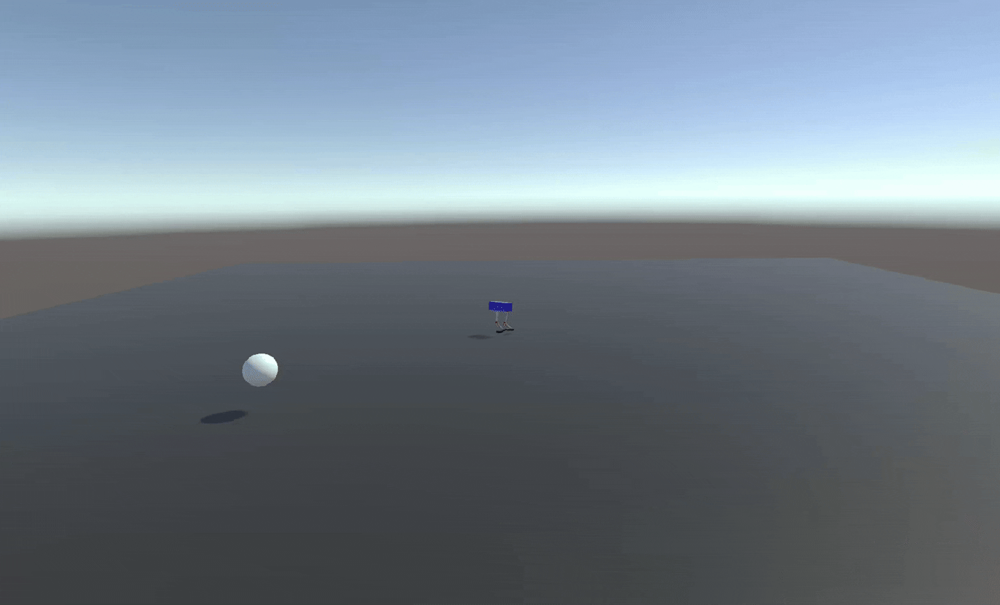
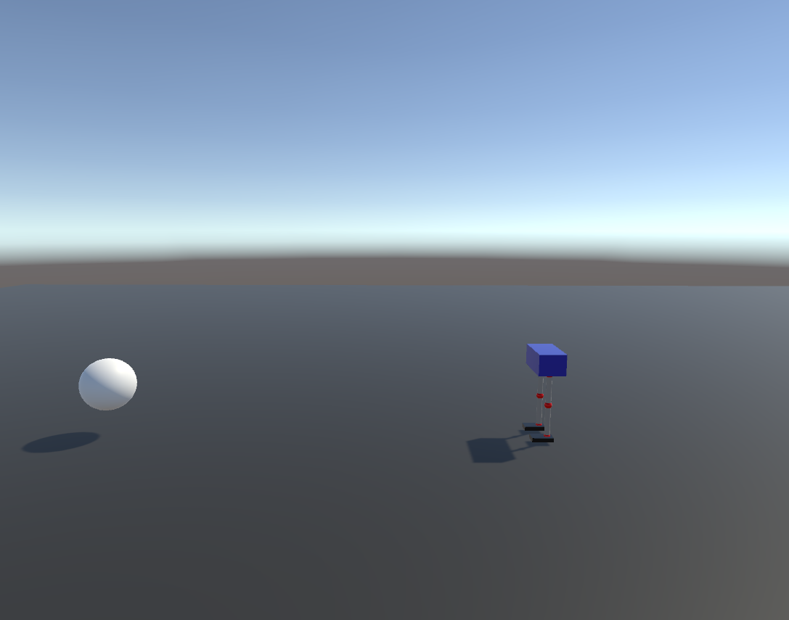
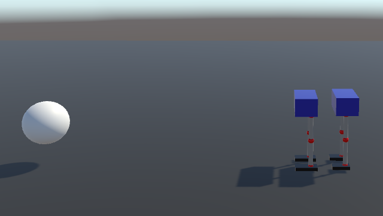
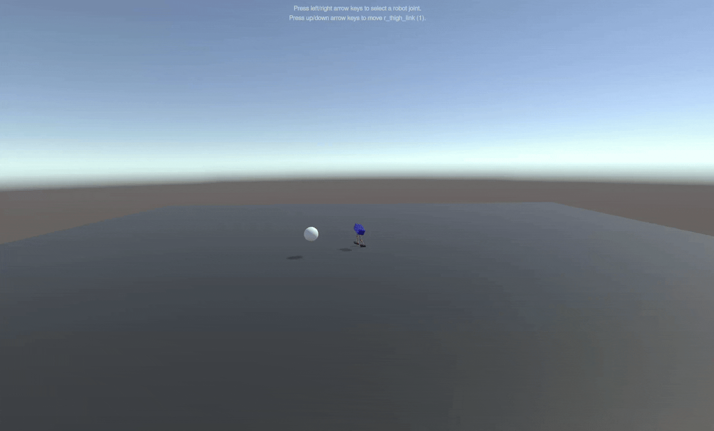
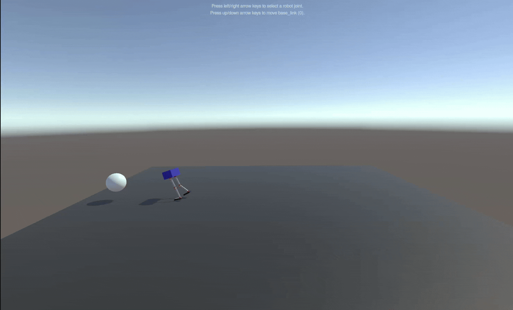

# Unity ML-agent Bipedal Robot Walking Project
## Model 3 (BipedalAgent_3.onnx)

</img>

<div style="text-align: center;">
    
    
</div>


### Modification Info
```
    private readonly float[] jointLowerDeg = { -90f, 0f, -65f, -90f, 0f, -65f };
    private readonly float[] jointUpperDeg = { 0f, 115f, 65f, 0f, 115f, 65f };
```
+ The range of motion of the hip joint was restricted to the anterior direction only
+ Changed center of Mass in URDF, Increased foot size

### Rewards
+ See **BipedalAgent.cs**
## Model 2 (BipedalAgent_2.onnx)
</img>
로봇 뒤에 위치한 Target에 대해 불안정하다
### Training Info
| Parameter | Value |
|-----------|-------|
| Algorithm | PPO |
| Total Steps | 65,400,000 |
| Batch Size | 1024 |
| Buffer Size | 10,240 |
| Learning Rate | 0.0003 |
| Hidden Units | 256 |
| Num Layers | 2 |
| Gamma | 0.99 |
| Time Horizon | 1000 |


### Observations (10)
- 타겟과의 거리 (1)
- 타겟 방향 벡터 x, z (2)
- 로봇 직립도 (1)
- 각 관절 각도 (6)

### Actions (6)
- Left Hip, Knee, Ankle
- Right Hip, Knee, Ankle

### Rewards
+ 직립 유지: +0.01 * uprightness
+ 높이 유지: +0.01 * height
+ 전진: +5.0 * progress
+ 목표 도달: +10.0
+ 넘어짐: -1.0

```
    private void CheckRewards() {
        float currentDistance = Vector3.Distance(baseLink.transform.position, target.position);
        float upright = Vector3.Dot(baseLink.transform.up, Vector3.up);

        // 1. 넘어짐 체크
        if (upright < 0.4f) {
            AddReward(-1f);
            EndEpisode();
            return;
        }
        // 2. 서있는 보상
        AddReward(upright * 0.01f);

        // 3. 높이 유지 보상
        float heightReward = Mathf.Clamp(baseLink.transform.position.y, 0f, 1f) * 0.01f;
        AddReward(heightReward);

        // 4. 전진 보상
        float progress = previousDistanceToTarget - currentDistance;
        AddReward(progress * 5f);

        previousDistanceToTarget = currentDistance;

        // 5. 목표 도달
        if (currentDistance < 0.5f) {
            AddReward(10f);
            EndEpisode();
        }
    }
```

## Model 1 (BipedalAgent_1.onnx)
</img>
항상 고정된 위치에서 로봇이 학습을 진행해 로봇 위치가 변하게 되면 Target Object에 도달하지 못하게 된다
### Training Info
| Parameter | Value |
|-----------|-------|
| Algorithm | PPO |
| Total Steps | 67,400,000 |
| Batch Size | 1024 |
| Buffer Size | 10,240 |
| Learning Rate | 0.0003 |
| Hidden Units | 256 |
| Num Layers | 2 |
| Gamma | 0.99 |
| Time Horizon | 1000 |

### Observations (10)
- 타겟과의 거리 (1)
- 타겟 방향 벡터 x, z (2)
- 로봇 직립도 (1)
- 각 관절 각도 (6)

### Actions (6)
- Left Hip, Knee, Ankle
- Right Hip, Knee, Ankle

### Rewards
+ 직립 유지: +0.01 * uprightness
+ 높이 유지: +0.01 * height
+ 전진: +5.0 * progress
+ 목표 도달: +10.0
+ 넘어짐: -1.0
```
    private void CheckRewards() {
        float currentDistance = Vector3.Distance(baseLink.transform.position, target.position);
        float upright = Vector3.Dot(baseLink.transform.up, Vector3.up);

        // 1. 넘어짐 체크
        if (upright < 0.4f) {
            AddReward(-1f);
            EndEpisode();
            return;
        }
        // 2. 서있는 보상
        AddReward(upright * 0.01f);

        // 3. 높이 유지 보상
        float heightReward = Mathf.Clamp(baseLink.transform.position.y, 0f, 1f) * 0.01f;
        AddReward(heightReward);

        // 4. 전진 보상
        float progress = previousDistanceToTarget - currentDistance;
        AddReward(progress * 5f);

        previousDistanceToTarget = currentDistance;

        // 5. 목표 도달
        if (currentDistance < 0.5f) {
            AddReward(10f);
            EndEpisode();
        }
    }
```